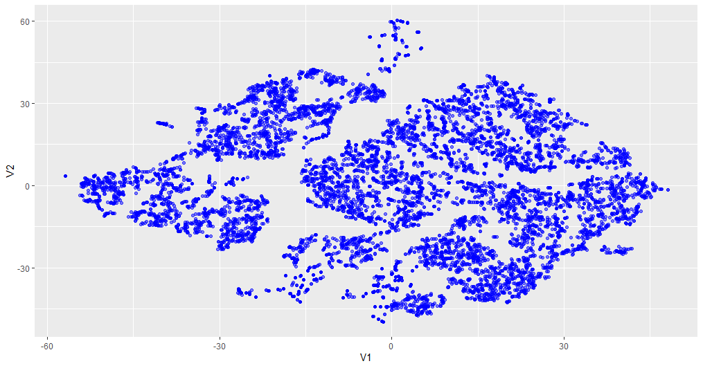
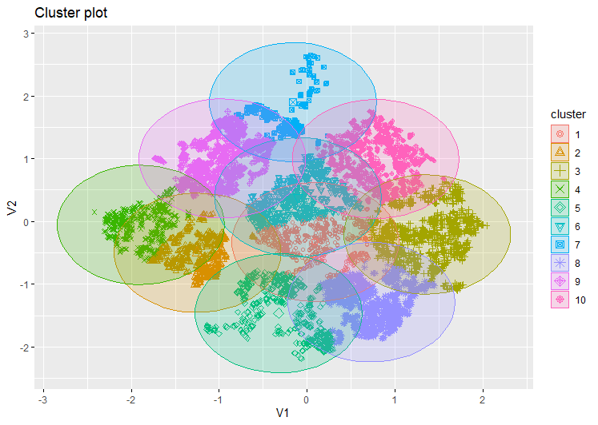
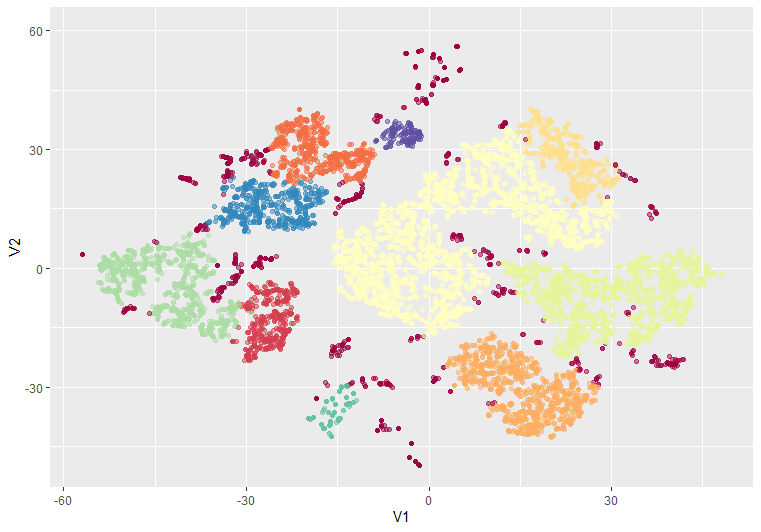
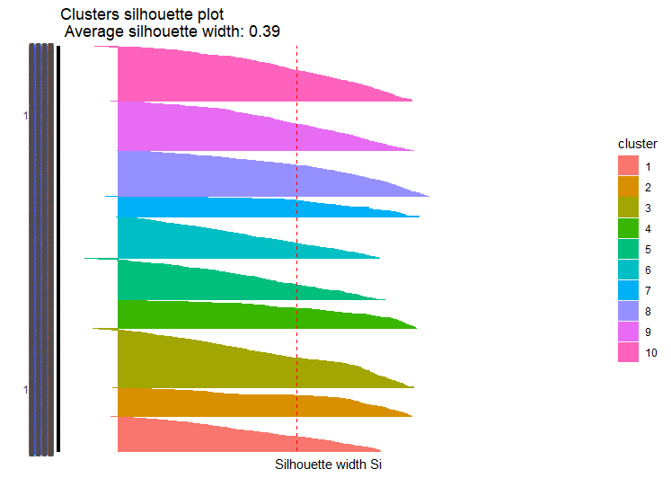
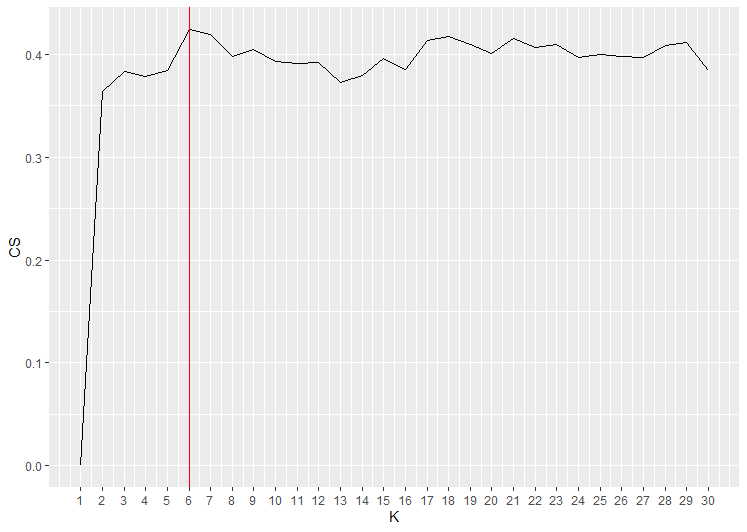
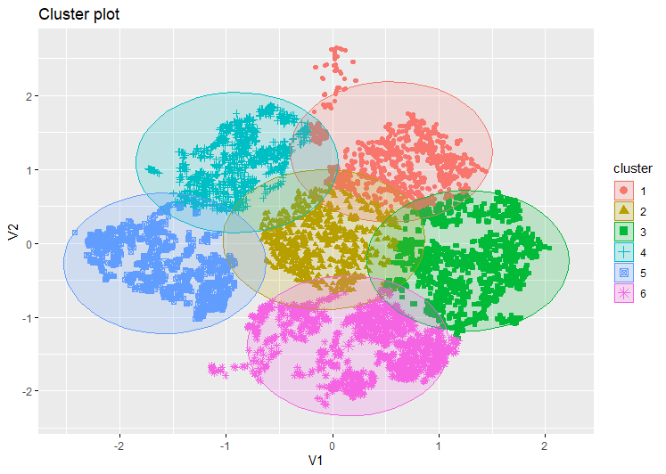

<style>
body {
text-align: justify}
</style>

# Análisis de Música

### Integrantes:
  - Isidora Lin Huang
  - Amparo Morel Pantoja
  - Yin Zhong Cai

#### Descripción

El objetivo de este proyecto es crear un programa computacional que a partir de una canción de referencia permita crear una lista de reproducción de 3 horas de duración, con canciones similares a la canción de referencia. La base de datos con la que trabajaremos incluye 447.622 canciones, con 36 variables.

#### -- Librerías a usar
En primer lugar, estas es la lista de librerías que usamos en este proyecto y la semilla que definimos para que nuestros resultados no varien:

```{r eval=FALSE}
library(ggplot2)
library(factoextra)
library(FactoMineR)
library(tidyverse)
library(Rtsne)
library(dbscan)
library(dplyr)
set.seed(216)
```

#### -- Limpieza de datos

Empezamos importando nuestros datos en un dataframe llamado "data" y eliminamos las canciones que presenten el mismo ID, ya que perjudica la busqueda de canciones si hay identificadores que se repiten. 


```{r eval=FALSE}
filename = file.choose()
data = readRDS(filename)
data <- data[!duplicated(data$track_id),]
```

Luego, tenemos que tener la canción de referencia para el cual se genere la lista con las canciones similares. Para esto, le preguntamos al usuario que eliga entre dos opciones:

* Ingresar el nombre de la canción y el nombre del artista/grupo.
* Ingresar el ID de la cancíon.

```{r eval=FALSE}
pregunta = readline(prompt = "Para crear su lista, marque 1 si desea ingresar el nombre de la cancíón y el nombre del artista/grupo o 2 si desea ingresar el id de la canción. Elija marcando 1 o 2             ")

if (pregunta == 1){
  pregunta2 = readline(prompt = "Cuál es el nombre de la canción? ")
  pregunta3 = readline(prompt = "Cuál es el nombre del artista/grupo? ")
  data1 <- filter(data, track_name == pregunta2 & artist_name == pregunta3)
}

if (pregunta == 2){
  pregunta4 = readline(prompt = "Cuál es el id de la canción? ")
  data1 <- filter(data, track_id == pregunta4)
}
```

Además, para este proyecto trabajaremos con una muestra aleatoria de aproximadamente el 2.2% de los datos, para poder tener un programa más eficiente y que el análisis de datos sea menos complejo.También incluimos la canción de referencia a nuestra muestra

```{r eval=FALSE}
data_sample <- data[sample(nrow(data), 10000), ]
data_sample[nrow(data_sample) + 1,] = data1
`````

Ahora, creamos un nuevo dataframe reducido, con las variables de interes para análizar los datos y poder agruparlos. Estas variables corresponden a las variables númericas, ya que consideramos que estas son las características que más representan a las canciones, y de esta forma estamos trabajando con solo un tipo de variable, lo que facilita el trabajo de agrupamiento de los datos.

```{r eval=FALSE}
data_parametros <-  select(data_sample, track_id, danceability, energy, key, loudness, mode, speechiness, acousticness, instrumentalness, liveness, valence, tempo)
````

De las 36 variables de los datos, trabajaremos con 12:

* track_id
* danceability
* energy
* key
* loudness
* mode
* speechiness
* acousticness
* instrumentalness
* liveness
* valence
* tempo

Luego, borramos los datos invalidos y lo que se encuentran repetidos

```{r eval=FALSE}
colSums(is.na(data_parametros))
data_parametros <- na.omit(data_parametros)
data_parametros <- data_parametros[!duplicated(data_parametros$track_id),]
```

Además, normalizamos nuestros datos, ya que se encuentran en diferentes unidades. 

```{r eval=FALSE}
min_max_norm <- function(x) {
  (x - min(x)) / (max(x) - min(x))
}
parametros_norm <- as.data.frame(lapply(data_parametros[,2:11], min_max_norm))
```


#### -- Reducción de dimensiones

Usaremos el algortimo de T-SNE para reducir las dimensiones de nuestros datos a 2 dimensiones, con esto representamos nuestros datos en un subespacio de menor dimensión, así tenemos un mejor manejo de nuestros datos. Y agregamos a este nuevo dataframe los ID correspondientes a cada dato.

```{r eval=FALSE}
data_tsne <- parametros_norm %>% 
  Rtsne(check_duplicates = FALSE) %>% 
  .$Y %>% 
  as.data.frame()

rownames(data_tsne) <- data_parametros$track_id
````

Luego, visualizamos nuestros datos

```{r eval=FALSE}
ggplot(data_tsne, aes(V1, V2)) + 
  geom_point(alpha = 0.5, color = "blue")
````



### Modelo 1

Para el primer modelo de clustering de datos, usaremos el algoritmo de K-means, el cual optimiza (minimiza) la suma de las distancias cuadráticas de cada dato al centroide de su cluster. Los hiperparámetros de este algoritmo corresponden a definir el k, que es el número de clusters, es decir, el número de agrupamientos en que se van a dividir nuestros datos, y de segundo hiperparámetro, es que el k sea aleatorio. Otro aspecto de este algoritmo, son las iteraciones con las que agrupa los datos, que corresponden a las iteraciones en las que los centroides se actualizan. Consideramos que para este trabajo, un número máximo de 100 iteraciones funcionaria para tratar de evitar que el resultado termine en un óptimo local, y así obtener un mejor rendimiento en el algoritmo la converger. Además, en cuanto a la elección del k, tomamos en consideración agrupar los datos en 10, pensado en 10  géneros de música, ya que de esta manera podriamos tener una variedad de grupos pero a la vez generealizar las caractericas de las canciones, por lo que definimos k igual a 10. 
```{r eval=FALSE}
kmeans_modelo <- kmeans(data_tsne, 10, iter.max  = 100)
kmeans_modelo
```

Luego, visualizamos los datos agrupados en 10 clusters 

```{r eval=FALSE}
fviz_cluster(kmeans_modelo, data = data_tsne, geom = c("point"),ellipse.type = "euclid")
```




### Modelo 2

Para el segundo modelo de clustering, usaremos el algortimo de DBSCAN, el cual se basa en densidades. Para esto, tenemos que definir los hiperparámetros de Eps, el cual es el radio que define la zona con el que se van a clasificar los datos y el MinPts, que es el mínimo de puntos para el criterio de los tipos de datos. Estos tipos de datos son los siguientes:

* Centrales: aquellos que dentro de la zona determinada por el Eps, cumplan con el mínimo de puntos.
* Frontera: no cumplen con el mínimo de datos, pero presentan en su zona al menos un dato central.
* Atípicos: no cumplen con el mínimo de datos y no tienen un dato central.

De esta manera, tomando en consideración que los datos son numerosos, definimos que Eps debería ser 4 para agrupar a los que están más cerca entre si, y que el mínimo de puntos es 60, pensando en que una lista de 3 horas de reproducción contendría alrededor de 60 canciones.

```{r eval=FALSE}
modelo_dbscan <- dbscan(data_tsne, eps = 4, minPts = 60)
```

Luego, visualimos nuestros datos agrupados, etiquetados según su tipo de dato

```{r eval=FALSE}
ggplot(data_tsne, aes(V1, V2, col = factor(modelo_dbscan$cluster))) + 
  geom_point(alpha = 0.5) +
  theme(legend.position = "none") +
  scale_color_brewer(palette="Spectral")
```



### Evaluación de los modelos

Antes de seleccionar un modelo a implementar, evaluaremos nuestros datos, para tener una idea general de como se comportan luego de haber reducido las dimensiones con el algortimo de T-SNE. Para esto, usaremos el estadístico de Hopkins, el cual evalua la tendencia de clusters, es decir, mide si un conjunto de datos presenta clusters naturales. Si el resultado es cercano a 1, indica datos altamente agrupados, en cambio, si es cercano a 0, indica una distribución uniforme de los datos.

```{r eval=FALSE}
get_clust_tendency(data_tsne, n = 30, graph = FALSE)
```

El resultado que obtuvimos del estadistico de Hopkins es 0.ajsdhajkhdkahsd, muy cercano a 1, lo que nos dice que nuestro datos están altamente agrupados y por ende, funciona aplicar a nuestros datos modelos de clustering.  

A continuación, tenemos que determinar el modelo de clustering que vamos a implementar para generar la lista de canciones. Donde es necesario tener en cuenta, que para crear nuestra lista, lo que haremos sera encontrar la canción de referencia en su cluster y generar una lista de todas las canciones que esten en el mismo cluster que la canción de referencia. Para esto, evaluaremos que modelo desempeña mejor para nuestro objetivo, teniendo en consideración los siguientes observaciones:

* En primer lugar, comparando los dos algoritmos usados, encontramos que en la visualización del algorimo de K-means, encontramos clusteres similares entre ellos, a diferencia del algoritmo de DBSCAN que presenta clusteres muy distintos entre ellos, viendose en gran manera que hay clusteres que agrupan muchos más datos que otros.

* Además, DBSCAN por ser un algortimo que etiqueta a los datos, tendriamos datos atípicos que se encuentren apartados de otros datos, teniendo datos que no se encuentren en un cluster, pudiendo no generar una lista de canciones en caso de que nuestra canción de referencia corresponda a un dato atípico.


Mediante estas observaciones, es que decidimos seleccionar el modelo 1, con el algoritmo de K-means, para generar nuestra lista de canciones. Por lo que, evaluaremos el rendimiento del K-means, al analizar el hiperparámetro k, que corresponde al número de clusteres total en que se agrupan nuestros datos. Para esto, usaremos el coeficiente de silueta, el cual identifica cual es el número óptimo de agrupamiento para los datos.

Ahora, evaluaremos el modelo 1 con sus hiperparámetros definidos en k igual 10, y visualizamos el gráfico con las siluetas de cada cluster.

```{r eval=FALSE}
clusters <- kmeans_modelo$cluster
coefSil <- silhouette(clusters, dist(data_tsne))
summary(coefSil)

fviz_silhouette(coefSil) + coord_flip()
```



A continuación, usamos el coeficienete de silueta para calcular el mejor k correspondinte a nustros datos, y graficamos el resultado.

```{r eval=FALSE}
siluetas <- numeric(30)

for (k in 2:30){
  modelo <- kmeans(data_tsne, centers = k)
  temp <- silhouette(modelo$cluster, dist(data_tsne))
  siluetas[k] <- mean(temp[,3])
}
tempDF <- data.frame(CS=siluetas, K=c(1:30))

ggplot(tempDF, aes(x=K, y=CS)) + 
  geom_line() +
  scale_x_continuous(breaks=c(1:30)) +
  geom_vline(xintercept = which(tempDF$CS == max(tempDF$CS)), col = "red")
```



De lo cual, obtuvimos que el mejor k debería ser 6. Y ahora aplicamos a nuestros datos, K-means con este nuevo k.

```{r eval=FALSE}
kmeans_modelo2 <- kmeans(data_tsne, which(tempDF$CS == max(tempDF$CS)), iter.max  = 100)
kmeans_modelo2
```

Visualizamos nuestros clusters.

```{r eval=FALSE}
fviz_cluster(kmeans_modelo2, data = data_tsne, geom = c("point"),ellipse.type = "euclid")
```



Evaluaremos ahora el modelo actualizado con el coeficiente de silueta. Donde observamos que al aplicar el nuevo k, obtenemos un mejor resultado en el coeficiente de silueta en comparación al del K-means anterior.

```{r eval=FALSE}
clusters2 <- kmeans_modelo2$cluster
coefSil2 <- silhouette(clusters2, dist(data_tsne))
summary(coefSil2)

fviz_silhouette(coefSil2) + coord_flip()
```


Luego, creamos un dataframe con las canciones y sus correspondientes cluster.

```{r eval=FALSE}
clusteres <- data.frame(kmeans_modelo$size, kmeans_modelo$centers)
data_kmeans <- data.frame(cluster = kmeans_modelo$cluster, data_parametros)

data_final <- merge(data_kmeans, data_sample, by="track_id")
data_final <- select(data_final, cluster, track_id, track_name, artist_id, artist_name, duration_ms)
```

Por último, buscamos la canción de referencia en nuestro dataframe y generemos una lista de canciones similares, con el nombre de la canción, el nombre del artista/grupo y la duración de cada canción.

```{r eval=FALSE}
if (pregunta == 1){
  n_fila = which(data_final$track_name == pregunta2)
  n_cluster = data_final$cluster[n_fila]
  cancion_selec <- filter(data_final, track_name == pregunta2)
  data_final <- data_final[-c(n_fila), ]
}

if (pregunta == 2){
  n_fila = which(data_final$track_id == pregunta4)
  n_cluster = data_final$cluster[n_fila]
  cancion_selec <- filter(data_final, track_id == pregunta4)
  data_final <- data_final[-c(n_fila), ]
} 


cluster_cancion <- filter(data_final, cluster == n_cluster)
playlist <- cluster_cancion[sample(nrow(cluster_cancion), 60), ]
playlist <- select(playlist, track_name, artist_name, duration_ms)
cancion_selec <- select(cancion_selec, track_name, artist_name, duration_ms)
rownames(playlist) = seq(length=nrow(playlist))


print("Canción seleccionada: ")
print.data.frame(cancion_selec)

print("Playlist de canciones similares: ")
print.data.frame(playlist)
```


Bibliografía:

 * Kmeans.R, Raimundo Sánchez
 * DBScan.R, Raimundo Sánchez
 * evaluacion_clusters.R, Raimundo Sánchez

[bibliografía de link, github, raimun2, Mineria-de-datos](https://github.com/raimun2/Mineria-de-datos)


